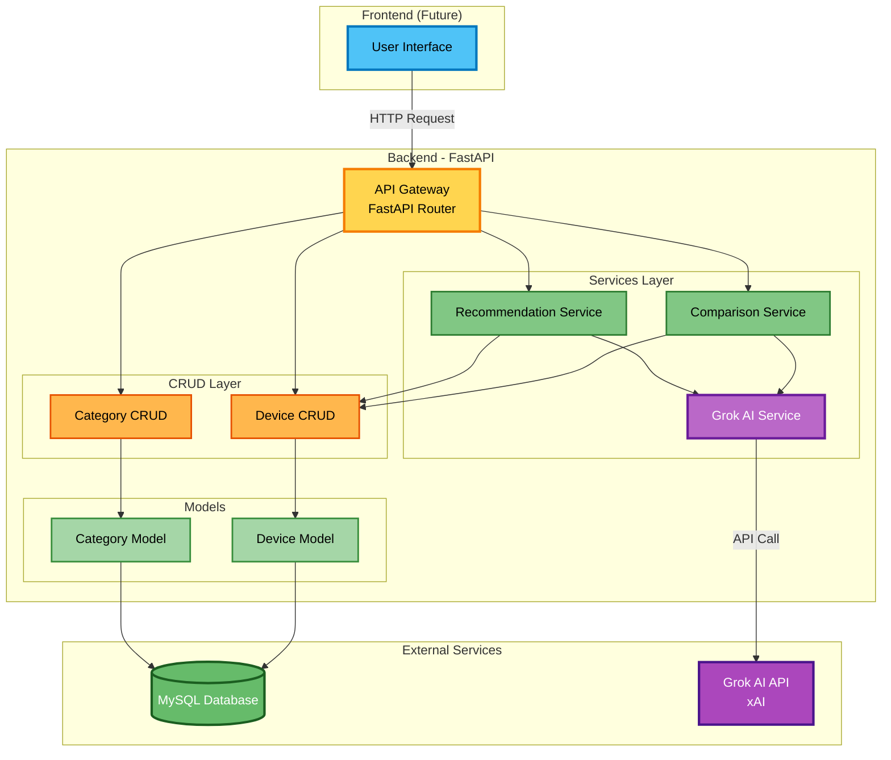
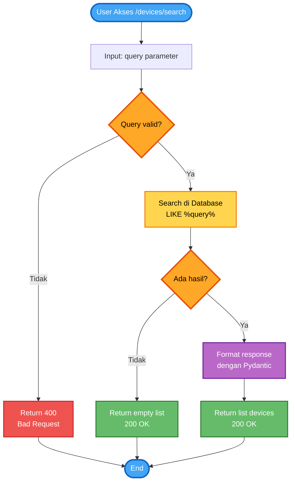
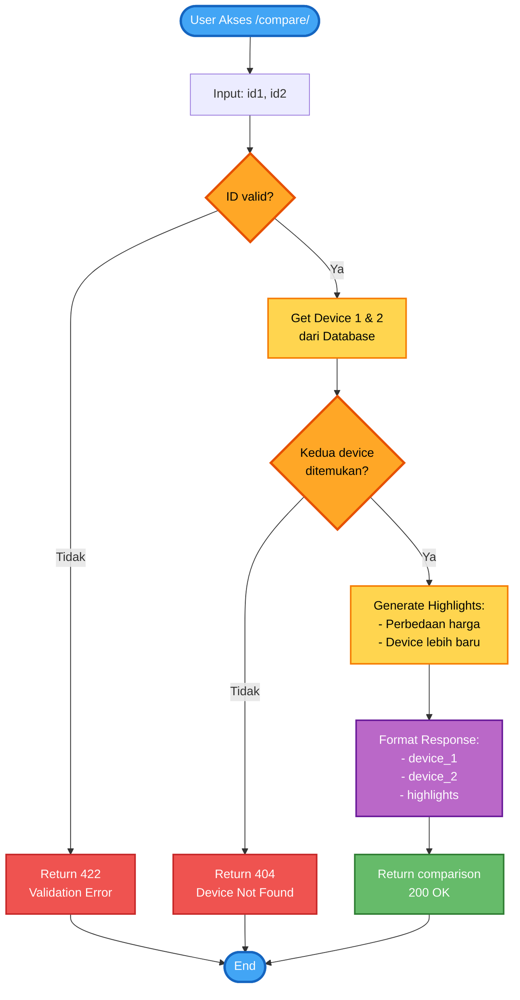
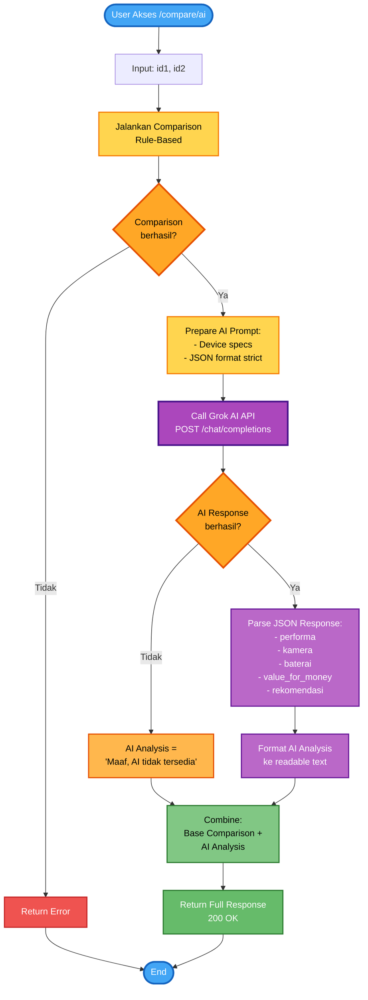
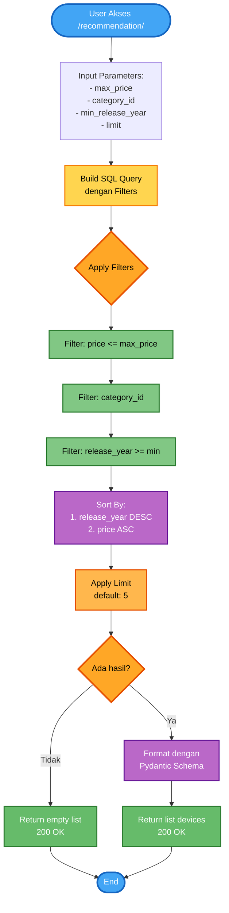
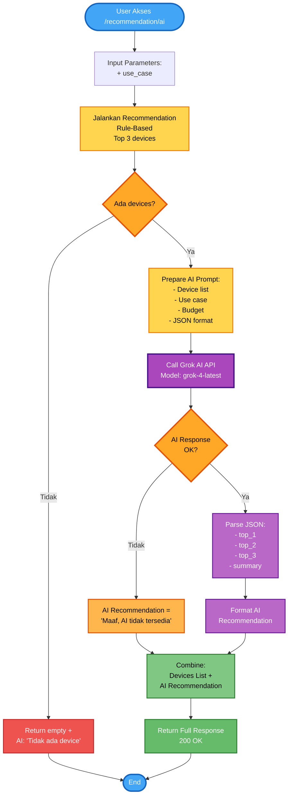
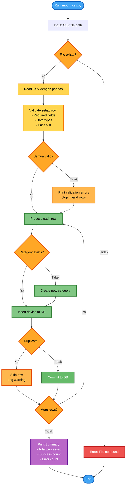
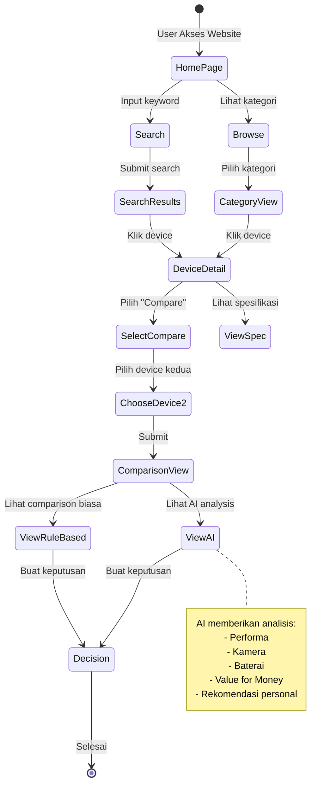

# COMPARELY - Flowcharts & Diagrams

Dokumentasi visual untuk sistem COMPARELY menggunakan Mermaid diagrams.

---

## 📊 1. Arsitektur Sistem

---

## 🔍 2. Flow Pencarian Perangkat

---

## ⚖️ 3. Flow Perbandingan Perangkat

---

## 🤖 4. Flow Perbandingan dengan AI

---

## 🎯 5. Flow Rekomendasi Perangkat

---

## 🧠 6. Flow Rekomendasi dengan AI

---

## 📥 7. Flow Import Data CSV

---

## 🔄 8. Activity Diagram - User Journey

---

## 📝 Catatan Diagram

### Konvensi Warna:
- 🔵 **Biru** (`#42A5F5`): Start/End points
- � **Orange** (`#FFA726`): Decision points (diamond shapes)
- �🟡 **Kuning** (`#FFD54F`): Processing/Logic
- 🟣 **Ungu** (`#BA68C8`, `#AB47BC`): AI/External services & formatting
- 🟢 **Hijau** (`#81C784`, `#66BB6A`): Success states & database operations
- 🔴 **Merah** (`#EF5350`): Error states
- 🟤 **Orange Muda** (`#FFB74D`): Warning/Skip states

### Cara Menggunakan:
1. Copy kode Mermaid ke Markdown viewer yang support Mermaid
2. Atau gunakan online editor: https://mermaid.live/
3. Untuk proposal, screenshot diagram dan masukkan ke dokumen
4. Diagram akan otomatis render dengan warna yang cerah dan jelas

---

**Dibuat**: 3 Desember 2025
**Untuk**: Proposal & Dokumentasi Proyek COMPARELY
